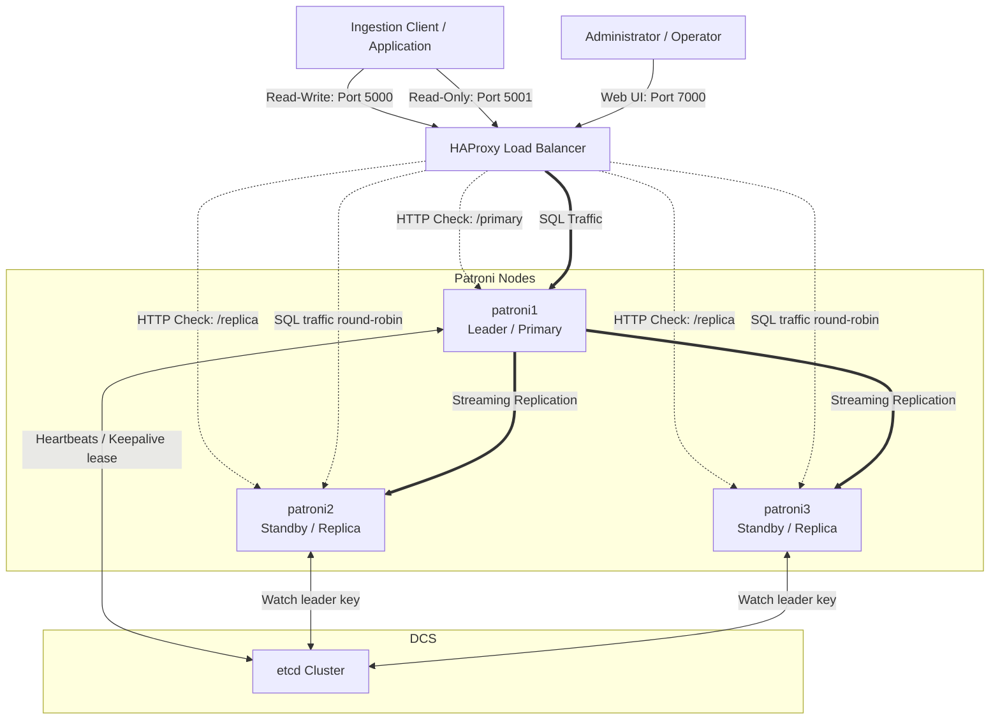
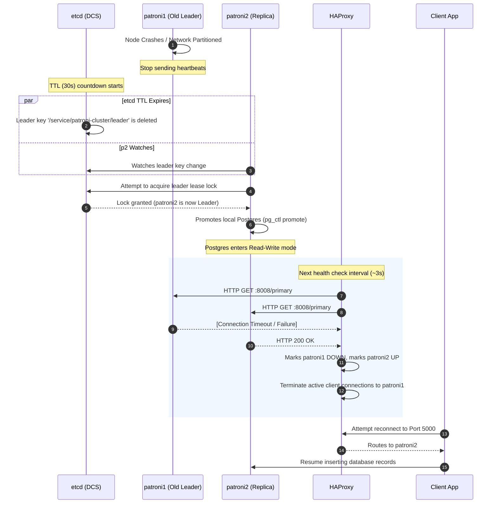

# Patroni HA Testing Lab Architecture

This document describes the high-availability (HA) architecture of the PostgreSQL cluster implemented in this lab. It outlines the components, data flows, port mappings, and failover mechanics.

---

## System Architecture Diagram

The diagram below illustrates how clients connect to the database nodes through HAProxy, and how Patroni utilizes etcd (Distributed Consensus Store) to coordinate replication and cluster state.

---

## Component Breakdown

The environment consists of several components working in tandem to maintain service availability and data integrity:

### 1. Distributed Consensus Store (DCS): `etcd`
*   **Role**: Coordinates the overall cluster state and configuration.
*   **Mechanism**: Patroni uses etcd to elect a single leader. The leader node holds a dynamic lease key in etcd (typically under `/service/<scope>/leader`). If the leader fails to renew this key before the Time to Live (TTL) expires, the lease is revoked, signaling a cluster failover.
*   **Importance**: Provides a single source of truth, preventing split-brain scenarios (where two nodes believe they are the primary).

### 2. Cluster Manager: `Patroni`
*   **Role**: An orchestrator daemon that runs alongside the PostgreSQL process on each database node.
*   **Responsibilities**:
    *   Interacts with etcd to acquire or monitor the leader lock.
    *   Starts, configures, stops, and bootstraps the local PostgreSQL server.
    *   Configures physical replication slots (`use_slots: true`) and tracks lag.
    *   Exposes a REST API (`8008`) used for diagnostics and health checking.
    *   Executes `pg_rewind` when necessary to heal diverged standbys.

### 3. Database: `PostgreSQL 16`
*   **Role**: The relational database engine.
*   **Replication**: Primary node runs in read-write mode. Standby replica nodes run in `hot_standby` mode, continuously pulling Write-Ahead Logs (WAL) from the primary via streaming replication.

### 4. Load Balancer: `HAProxy`
*   **Role**: Acts as the single point of entry for clients, ensuring they connect to the correct database role.
*   **Mechanics**: Instead of pinging PostgreSQL directly, HAProxy queries the Patroni REST API (`8008`) of each node using HTTP check endpoints. 
    *   Nodes responding with HTTP code `200` to `/primary` are routed to the write pool on port `5000`.
    *   Nodes responding with HTTP code `200` to `/replica` are routed to the read-only pool on port `5001`.

### 5. Ingestion Client: `client`
*   **Role**: Simulates a production application.
*   **Behavior**: Connects to HAProxy port `5000` and continuously inserts random sensor data. If a connection failure occurs (such as during a failover), the client retries until HAProxy directs it to the new leader.

---

## Network Ports & Mapping

| Component | Internal Port | Host Port | Protocol | Purpose / Description |
| :--- | :--- | :--- | :--- | :--- |
| **`etcd`** | `2379` | `2379` | TCP / HTTP | Client API communications (Patroni nodes querying cluster state). |
| **`etcd`** | `2380` | *None* | TCP | Peer-to-peer etcd cluster communication. |
| **`patroni`** | `8008` | *None* | TCP / HTTP | Patroni REST API (health checks by HAProxy, administration via `patronictl`). |
| **`postgresql`** | `5432` | *None* | TCP / SQL | Database connection and streaming replication traffic. |
| **`haproxy`** | `5000` | `5000` | TCP / SQL | **Read-Write Endpoint**: Routes connections to the current PostgreSQL Primary/Leader. |
| **`haproxy`** | `5001` | `5001` | TCP / SQL | **Read-Only Endpoint**: Routes connections to active PostgreSQL Standby Replicas. |
| **`haproxy`** | `7000` | `7000` | TCP / HTTP | HAProxy Stats Dashboard (traffic volumes, health checks, active backend nodes). |

---

## Failover Dynamics & Timeline

When the primary node (`patroni1`) becomes unavailable, the system executes an automated recovery sequence:

### Detailed Timeline Breakdown:
1.  **Detection (etcd Lease Expiration)**: By default, Patroni has a `loop_wait` of `10` seconds and a DCS lease TTL of `30` seconds. If the leader fails to renew its lease (due to a crash or network partition), the leader key is deleted after a maximum of 30 seconds.
2.  **Election**: The surviving replicas continuously monitor the etcd leader key. When the key is deleted, the replica with the least lag (or whichever wins the race) tries to write its own name to the leader key.
3.  **Promotion**: The replica that successfully acquires the leader key promotes its local PostgreSQL database from read-only standby mode to read-write primary mode.
4.  **Routing Update**: HAProxy detects the change on its next check interval (configured via `inter 3s` in `haproxy.cfg`).
    *   `patroni1`'s `/primary` check fails.
    *   `patroni2`'s `/primary` check begins returning HTTP `200 OK`.
    *   HAProxy drops existing connections to the old primary and routes new port `5000` connections to the new leader.
5.  **Healing (Rejoin)**: When the old primary (`patroni1`) recovers, it registers with etcd as a standby node. Since its timeline diverges from the new primary, Patroni runs `pg_rewind` to rewind `patroni1`'s WAL to the point of divergence, configures it to replicate from `patroni2`, and starts PostgreSQL in standby mode.

---

## Split-Brain Prevention

A "split-brain" occurs if two nodes believe they are both the primary/write leader simultaneously. Patroni prevents this through the following safeguards:
*   **Single-Leader DCS lock**: etcd enforces that only one node can possess the leader key at any given time.
*   **Demotion on DCS Loss**: If a leader node cannot reach etcd to renew its lease (e.g., due to a network partition), Patroni will automatically demote the local PostgreSQL instance to read-only mode *before* the etcd lease expires. This ensures that the old primary is safe before a replica gets promoted.
