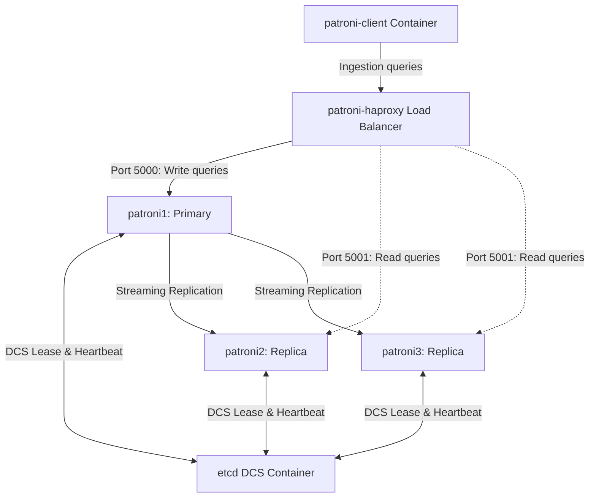

# Classic 3-Node Patroni Cluster Workshop Guide & Simulation Report

This document serves as a comprehensive, hands-on workshop guide and execution report based on the automated simulations run in the classic 3-node Patroni lab. It details the system architecture, core fault-tolerance behaviors, failure scenarios (leader crash, DCS outage, network partition), and recovery procedures.

---

## 1. Classic Lab Architecture & Design

The classic Patroni lab simulates a standard high-availability PostgreSQL cluster layout:
*   **3 Patroni Nodes**: Orchestrating PostgreSQL instances and managing clustering state (`patroni1`, `patroni2`, `patroni3`).
*   **1 Etcd DCS Container**: Serving as the Distributed Consensus Store (DCS) for the cluster (`patroni-etcd`).
*   **1 HAProxy Load Balancer**: Acting as the entry point for client database access (`patroni-haproxy`), routing writes to the primary on port `5000` and reads to standby replicas on port `5001`.
*   **1 Ingestion Client**: Simulating continuous transactional workloads by inserting mock telemetry data (`patroni-client`).

### Architecture Topology



---

## 2. Core Failure & Resilience Scenarios

Below is the chronological walkthrough of the failure scenarios simulated, including logs and detailed assessments of Patroni's behavior.

### Scenario 1: Leader Node Termination (Failover)
We simulate a sudden hardware crash or power failure on the active cluster leader (`patroni1`).

#### Step-by-Step Walkthrough
1.  Verify the initial state: `patroni1` is the running Leader on Timeline 1.
2.  Stop the active leader container: `docker compose stop patroni1`.
3.  The lease for `patroni1` expires in etcd (default TTL: 10s).
4.  Surviving replicas (`patroni2`, `patroni3`) detect the vacancy.
5.  `patroni3` successfully acquires the leader key in etcd, promotes itself to Leader, and increments the timeline from `1` to `2`.
6.  The remaining replica (`patroni2`) re-targets its replication stream to the new primary (`patroni3`).

#### Simulated Logs
```
==================================================
COMMAND: make status
==================================================
+ Cluster: patroni-cluster (7660931748554358824) +-------------+-----+------------+-----+
| Member   | Host     | Role    | State     | TL | Receive LSN | Lag | Replay LSN | Lag |
+----------+----------+---------+-----------+----+-------------+-----+------------+-----+
| patroni1 | patroni1 | Leader  | running   |  1 |             |     |            |     |
| patroni2 | patroni2 | Replica | streaming |  1 |   0/4000000 |   0 |  0/4000000 |   0 |
| patroni3 | patroni3 | Replica | streaming |  1 |   0/4000000 |   0 |  0/4000000 |   0 |
+----------+----------+---------+-----------+----+-------------+-----+------------+-----+

==================================================
COMMAND: make simulate-leader-failure
==================================================
Detecting current cluster leader...
Simulating leader failure: stopping patroni1 container...
 Container patroni1 Stopping 
 Container patroni1 Stopped 

==================================================
COMMAND: make status
==================================================
+ Cluster: patroni-cluster (7660931748554358824) +-------------+-----+------------+-----+
| Member   | Host     | Role    | State     | TL | Receive LSN | Lag | Replay LSN | Lag |
+----------+----------+---------+-----------+----+-------------+-----+------------+-----+
| patroni1 | patroni1 | Replica | stopped   |    |     unknown |     |    unknown |     |
| patroni2 | patroni2 | Replica | streaming |  2 |   0/4000700 |   0 |  0/4000700 |   0 |
| patroni3 | patroni3 | Leader  | running   |  2 |             |     |            |     |
+----------+----------+---------+-----------+----+-------------+-----+------------+-----+
```

---

### Scenario 2: Node Recovery & Rejoining
We bring back the previously crashed leader (`patroni1`) and observe how it safely transitions to a replica.

#### Step-by-Step Walkthrough
1.  Start the stopped container: `docker compose start patroni1`.
2.  `patroni1` starts up, reads its local state, and contacts the etcd DCS.
3.  It finds that `patroni3` is now the active Leader on Timeline 2.
4.  `patroni1` automatically adjusts its configuration, starts as a replica, performs pg_rewind if necessary to discard diverged transactions, and begins streaming from the new leader `patroni3`.

#### Simulated Logs
```
==================================================
COMMAND: docker compose start patroni1 patroni2 patroni3
==================================================
 Container patroni1 Starting 
 Container patroni1 Started 

==================================================
COMMAND: make status
==================================================
+ Cluster: patroni-cluster (7660931748554358824) +-------------+-----+------------+-----+
| Member   | Host     | Role    | State     | TL | Receive LSN | Lag | Replay LSN | Lag |
+----------+----------+---------+-----------+----+-------------+-----+------------+-----+
| patroni1 | patroni1 | Replica | streaming |  2 |   0/40011D8 |   0 |  0/40011D8 |   0 |
| patroni2 | patroni2 | Replica | streaming |  2 |   0/40011D8 |   0 |  0/40011D8 |   0 |
| patroni3 | patroni3 | Leader  | running   |  2 |             |     |            |     |
+----------+----------+---------+-----------+----+-------------+-----+------------+-----+
```

---

### Scenario 3: Complete DCS Outage
What happens when the consensus layer becomes entirely unavailable?

#### Step-by-Step Walkthrough
1.  Stop the etcd DCS database container: `docker compose stop etcd`.
2.  Patroni nodes cannot renew their lease keys or perform health check updates.
3.  The active leader (`patroni3`) realizes it cannot contact the DCS.
4.  To prevent a potential split-brain, the leader demotes itself and restricts writes.
5.  Attempting to run status commands fails or times out because etcd client drivers continually attempt to establish connections.
6.  Once etcd is restarted, the nodes reconnect, re-evaluate quorum, and elect the leader again.

#### Simulated Logs
```
==================================================
COMMAND: make status (timeout: 10s)
==================================================
2026-07-10 16:15:34,081 - WARNING - failed to resolve host etcd: [Errno -5] No address associated with hostname
2026-07-10 16:15:34,087 - ERROR - Failed to get list of machines from http://etcd:2379/v3beta: MaxRetryError
make: *** [Makefile:54: status] Terminated
Command timed out or exited with status 124

==================================================
COMMAND: make recover-dcs
==================================================
Restarting DCS (etcd) container...
docker compose start etcd
 Container patroni-etcd Starting 
 Container patroni-etcd Started 
Waiting for etcd to be healthy on port 2379...
 etcd is healthy.
```

---

### Scenario 4: Leader Network Partition
We isolate the active leader node (`patroni3`) from the network bridge to simulate a switch or cable failure.

#### Step-by-Step Walkthrough
1.  Isolate `patroni3` from the Docker bridge network: `docker network disconnect classic_3_nodes_patroni-net patroni3`.
2.  `patroni3` cannot reach the etcd DCS container, nor can the standbys reach it.
3.  `patroni3` demotes itself to a replica.
4.  Surviving replicas (`patroni1` and `patroni2`) can still communicate with etcd. They detect the lease vacancy and hold a Raft vote.
5.  `patroni1` is elected as the new Leader on Timeline 3.
6.  When the network partition is healed, the former leader `patroni3` discovers it has been demoted, runs pg_rewind, and registers as a replica streaming from `patroni1`.

#### Simulated Logs
```
==================================================
COMMAND: make simulate-network-partition
==================================================
Detecting current cluster leader...
Simulating network partition for leader patroni3 on network classic_3_nodes_patroni-net...

==================================================
COMMAND: make recover-network-partition
==================================================
Re-connecting all Patroni containers to the network to heal any partitions...
Network partition healed.

==================================================
COMMAND: make status
==================================================
+ Cluster: patroni-cluster (7660933450241015847) +-------------+-----+------------+-----+
| Member   | Host     | Role    | State     | TL | Receive LSN | Lag | Replay LSN | Lag |
+----------+----------+---------+-----------+----+-------------+-----+------------+-----+
| patroni1 | patroni1 | Leader  | running   |  3 |             |     |            |     |
| patroni2 | patroni2 | Replica | streaming |  3 |   0/6000000 |   0 |  0/6000000 |   0 |
| patroni3 | patroni3 | Replica | streaming |  3 |   0/4002970 |   0 |  0/4002970 |   0 |
+----------+----------+---------+-----------+----+-------------+-----+------------+-----+
```

---

### Scenario 5: Replica Reinitialization (Re-cloning)
If a standby database gets corrupted or suffers unrecoverable replication errors, it can be re-cloned from scratch.

#### Step-by-Step Walkthrough
1.  Run the reinit command on a target replica node (e.g. `patroni2`) using the `--force` flag.
2.  Patroni shuts down the target PostgreSQL database engine.
3.  It completely wipes the local PostgreSQL data directory (`pgdata`).
4.  It runs `pg_basebackup` (or custom recovery scripts) to pull a fresh copy of all data files from the current leader (`patroni1`).
5.  Once the backup finishes, it restarts PostgreSQL and rejoins streaming replication.

#### Simulated Logs
```
==================================================
COMMAND: docker compose exec -T patroni1 patronictl -c /etc/patroni/patroni.yml reinit patroni-cluster patroni2 --force < /dev/null
==================================================
+ Cluster: patroni-cluster (7660932983069159464) +-------------+-----+------------+-----+
| Member   | Host     | Role    | State     | TL | Receive LSN | Lag | Replay LSN | Lag |
+----------+----------+---------+-----------+----+-------------+-----+------------+-----+
| patroni1 | patroni1 | Leader  | running   |  3 |             |     |            |     |
| patroni2 | patroni2 | Replica | streaming |  3 |   0/4002970 |   0 |  0/4002970 |   0 |
+----------+----------+---------+-----------+----+-------------+-----+------------+-----+
Success: reinitialize for member patroni2
```

---

## 3. Best Practices & Key Takeaways

1.  **DCS Redundancy**: In a real production deployment, never deploy a single DCS node. The DCS (etcd) cluster must consist of at least 3 nodes (preferably 5) distributed across physical servers or failure domains to ensure quorum.
2.  **Graceful Recovery via timeline increment**: Patroni uses PostgreSQL timeline branches to guarantee that nodes rejoining after a partition discard diverged local writes and sync up cleanly with the current leader.
3.  **Automated Client Routing**: By utilizing a load balancer like HAProxy in front of Patroni nodes, clients are routed transparently to the active write node without requiring manual target changes.
