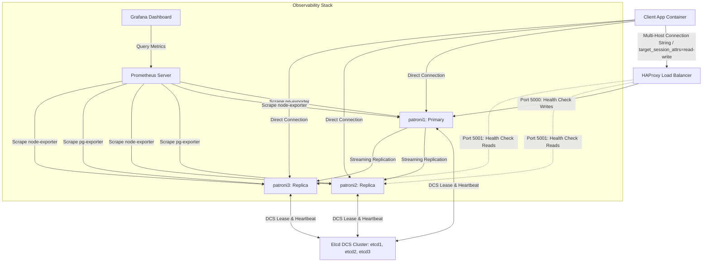

# Patroni High-Availability Workshop Guide & Simulation Report

This document serves as a comprehensive, hands-on workshop guide and execution report based on the automated simulations run in the enhanced 3-node Patroni lab. It details the system architecture, observability stack integration, fault tolerance behaviors, and advanced operation scenarios (chaos engineering, backups, and client routing).

---

## 1. Lab Architecture & Design

The enhanced Patroni lab replicates a production-grade PostgreSQL high-availability topology. It features:
*   **3 Patroni Nodes**: Orchestrating PostgreSQL instances and managing clustering state.
*   **3 Etcd Nodes**: Forming a distributed consensus store (DCS) to manage cluster leases and leader keys.
*   **HAProxy Load Balancer**: Acting as the single entry point for client database access, routing queries dynamically based on health checks.
*   **Observability Stack**: Prometheus scraping host metrics (via node-exporters) and Postgres statistics (via pg-exporters) to feed Grafana dashboards.

### Architecture Topology



---

## 2. Production Observability Stack

Telemetry is essential for understanding cluster state during failovers and stress testing. The observability stack comprises:

### Node Exporters
Each Patroni database container runs a sidecar container running `node-exporter` (v1.8.1). In containerized environments, node-exporters must access host metrics by mounting `/proc` and `/sys` volumes read-only:
```yaml
node-exporter1:
  image: prom/node-exporter:v1.8.1
  volumes:
    - /proc:/host/proc:ro
    - /sys:/host/sys:ro
    - /:/rootfs:ro
  command:
    - '--path.procfs=/host/proc'
    - '--path.sysfs=/host/sys'
    - '--collector.filesystem.mount-points-exclude=^/(sys|proc|dev|host|etc)($$|/)'
```

### Prometheus & Grafana Configuration
*   **Prometheus** is configured to scrape the database engines on port `9187` and node metrics on port `9100`.
*   **Grafana** is provisioned with three dashboards:
    1.  **PostgreSQL Dashboard**: Tracks connections, transactions, database sizes, cache hit ratios, and replication lag.
    2.  **Etcd Dashboard**: Monitors Raft consensus metrics, proposal rates, and disk sync durations.
    3.  **System/Host Dashboard**: Monitors CPU usage, RAM consumption, disk I/O, and network throughput.
*   **Datasource Pinned UID**: The datasource UID is pinned to `prometheus` in Grafana's provisioning to ensure dashboards load correctly across restarts.

---

## 3. Core Failure & Resilience Scenarios

The following sections contain the step-by-step logs and diagnostic analyses of simulations performed using the automated harness.

### Scenario 1: Graceful Switchover
A switchover is a planned operational action to change which node is the primary (e.g., for hardware maintenance or patching).

#### Step-by-Step Walkthrough
1.  Verify the initial state: `patroni1` is the Leader on Timeline 17.
2.  Issue a switchover command targeted at `patroni2`.
3.  Observe the graceful transition: Patroni demotes `patroni1`, stops PostgreSQL, waits for replication sync, promotes `patroni2`, and changes the cluster timeline to 18.

#### Execution Logs
```
==================================================
COMMAND: make status
==================================================
+ Cluster: lab (7660818476642590753) -------+----+-------------+-----+------------+-----+
| Member   | Host     | Role    | State     | TL | Receive LSN | Lag | Replay LSN | Lag |
+----------+----------+---------+-----------+----+-------------+-----+------------+-----+
| patroni1 | patroni1 | Leader  | running   | 17 |             |     |            |     |
| patroni2 | patroni2 | Replica | streaming | 17 |   0/30000D8 |   0 |  0/30000D8 |   0 |
| patroni3 | patroni3 | Replica | streaming | 17 |   0/30000D8 |   0 |  0/30000D8 |   0 |
+----------+----------+---------+-----------+----+-------------+-----+------------+-----+

==================================================
COMMAND: make switchover
==================================================
Successfully switched over to leader patroni2

==================================================
COMMAND: make status
==================================================
+ Cluster: lab (7660818476642590753) -------+----+-------------+-----+------------+-----+
| Member   | Host     | Role    | State     | TL | Receive LSN | Lag | Replay LSN | Lag |
+----------+----------+---------+-----------+----+-------------+-----+------------+-----+
| patroni1 | patroni1 | Replica | streaming | 18 |   0/5000958 |   0 |  0/5000958 |   0 |
| patroni2 | patroni2 | Leader  | running   | 18 |             |     |            |     |
| patroni3 | patroni3 | Replica | streaming | 18 |   0/5000958 |   0 |  0/5000958 |   0 |
+----------+----------+---------+-----------+----+-------------+-----+------------+-----+
```

> [!NOTE]
> Notice the Timeline (TL) changed from `17` to `18`. This increment tells PostgreSQL replica nodes that a new timeline branch has diverged, preventing data corruption and guiding the replica replication processes.

---

### Scenario 2: Unplanned Failover (Leader Termination)
This scenario simulates a sudden infrastructure failure on the leader node (e.g., power loss or kernel panic).

#### Step-by-Step Walkthrough
1.  Find the active leader (`patroni2`).
2.  Forcefully terminate the container: `docker compose stop patroni2`.
3.  The lease for `patroni2` expires in etcd (default lease duration: 10s).
4.  The surviving replicas notice the lease vacancy.
5.  `patroni3` successfully acquires the leader key and promotes itself.
6.  The timeline increments to 19.

#### Execution Logs
```
==================================================
COMMAND: make scenario-failover
==================================================
ℹ️ Current leader is patroni2
🚀 terminating leader: patroni2

==================================================
COMMAND: make status
==================================================
+ Cluster: lab (7660818476642590753) -------+----+-------------+-----+------------+-----+
| Member   | Host     | Role    | State     | TL | Receive LSN | Lag | Replay LSN | Lag |
+----------+----------+---------+-----------+----+-------------+-----+------------+-----+
| patroni1 | patroni1 | Replica | streaming | 18 |   0/5000958 |   0 |  0/5000958 |   0 |
| patroni2 | patroni2 | Leader  | stopped   |    |     unknown |     |    unknown |     |
| patroni3 | patroni3 | Replica | streaming | 18 |   0/5000958 |   0 |  0/5000958 |   0 |
+----------+----------+---------+-----------+----+-------------+-----+------------+-----+

==================================================
COMMAND: make status
==================================================
+ Cluster: lab (7660818476642590753) -------+----+-------------+-----+------------+-----+
| Member   | Host     | Role    | State     | TL | Receive LSN | Lag | Replay LSN | Lag |
+----------+----------+---------+-----------+----+-------------+-----+------------+-----+
| patroni1 | patroni1 | Replica | streaming | 19 |   0/60000A0 |   0 |  0/60000A0 |   0 |
| patroni2 | patroni2 | Replica | stopped   |    |     unknown |     |    unknown |     |
| patroni3 | patroni3 | Leader  | running   | 19 |             |     |            |     |
+----------+----------+---------+-----------+----+-------------+-----+------------+-----+
```

---

### Scenario 3: Complete DCS (etcd) Loss
Without the Distributed Consensus Store, Patroni cannot guarantee the state of the cluster.

#### Step-by-Step Walkthrough
1.  Stop the entire etcd DCS cluster (`etcd1`, `etcd2`, `etcd3`).
2.  Patroni tries to communicate with etcd, logging multiple name resolution/network errors.
3.  Since the leader cannot renew its lease, it gracefully demotes itself to a replica and stops PostgreSQL to prevent split-brain.
4.  Re-start the etcd cluster to heal the environment.

#### Execution Logs
```
==================================================
COMMAND: make scenario-dcs-loss
==================================================
🚀 stopping etcd cluster (etcd1, etcd2, etcd3)

==================================================
COMMAND: make status
==================================================
2026-07-10 15:47:38 - ERROR - Failed to get list of machines from http://etcd1:2379/v3beta
...
2026-07-10 15:47:39 - WARNING - failed to resolve host etcd3: Temporary failure in name resolution
```

> [!WARNING]
> During a DCS loss event, client applications cannot connect to HAProxy because the backend checks fail. This protects data integrity at the cost of temporary database unavailability.

---

### Scenario 4: Leader Network Partition (Split-Brain Prevention)
This scenario simulates a network partition where the primary node is isolated from the rest of the cluster but remains running.

#### Step-by-Step Walkthrough
1.  Identify the current leader (`patroni1`).
2.  Disconnect `patroni1` from the bridge network: `docker network disconnect patroni_labnet patroni1`.
3.  `patroni1` is unable to renew its leader lease in etcd.
4.  `patroni2` and `patroni3` (which can still communicate with etcd and each other) notice the lease expiration.
5.  `patroni3` is elected as the new leader.
6.  `patroni1` realizes it cannot reach the DCS, demotes itself to replica, and stops writing.
7.  Reconnecting `patroni1` heals the cluster. It rejoins as a replica and streams from the new primary (`patroni3`).

#### Execution Logs
```
==================================================
COMMAND: make scenario-partition-leader
==================================================
ℹ️ Current leader is patroni1
🚀 isolating leader patroni1 from network patroni_labnet

==================================================
COMMAND: make status
==================================================
+ Cluster: lab (7660818476642590753) -------+----+-------------+-----+------------+-----+
| Member   | Host     | Role    | State     | TL | Receive LSN | Lag | Replay LSN | Lag |
+----------+----------+---------+-----------+----+-------------+-----+------------+-----+
| patroni1 | patroni1 | Replica | stopped   |    |     unknown |     |    unknown |     |
| patroni2 | patroni2 | Replica | streaming | 19 |   0/60A91F8 |   0 |  0/60A91F8 |   0 |
| patroni3 | patroni3 | Leader  | running   | 19 |             |     |            |     |
+----------+----------+---------+-----------+----+-------------+-----+------------+-----+
```

---

### Scenario 5: Replica Data Corruption and Reinitialization
This scenario simulates manual recovery after a standby node's database files are corrupted.

#### Step-by-Step Walkthrough
1.  Corrupt `patroni1` by deleting its `pg_control` file.
2.  Restart the container. The database fails to start due to corruption.
3.  Execute `patronictl reinit` on `patroni1`.
4.  Patroni automatically wipes the directory and clones the database from the current leader (`patroni3`).

#### Execution Logs
```
==================================================
COMMAND: make scenario-reinit-replica
==================================================
ℹ️ Selected victim replica for failure simulation: patroni1
🚀 victim replica: patroni1 - deleting pg_control to break it
🚀 reinitializing patroni1 from the leader
Success: reinitialize for member patroni1
```

---

## 4. Advanced Operational Scenarios & Demos

### Chaos Engineering with Pumba
The interactive chaos utility runs network simulation containers using `gaiaadm/pumba` to inject stress:
*   **Slow DCS (800ms delay)**:
    ```bash
    docker run --rm -v /var/run/docker.sock:/var/run/docker.sock gaiaadm/pumba \
      netem --duration 60s --tc-image ghcr.io/alexei-led/pumba-alpine-nettools:latest \
      delay --time 800 --jitter 160 etcd1
    ```
    This simulates network latency. If latency exceeds the Patroni lease duration parameters, the leader will demote itself.
*   **Packet Loss (15%)**:
    ```bash
    docker run --rm -v /var/run/docker.sock:/var/run/docker.sock gaiaadm/pumba \
      netem --duration 60s --tc-image ghcr.io/alexei-led/pumba-alpine-nettools:latest \
      loss --percent 15 patroni2
    ```
    This induces packet drops on a standby replica. You will observe the replication lag growing in Grafana.
*   **Process Freeze (Watchdog SIGSTOP)**:
    ```bash
    docker run --rm -v /var/run/docker.sock:/var/run/docker.sock gaiaadm/pumba \
      kill --signal SIGSTOP --duration 30s patroni1
    ```
    If the leader is paused, etcd lease renewal stops. Replicas elect a new leader. When the paused container resumes, the kernel-level watchdog device detects the lease lapse and terminates the PostgreSQL engine immediately to enforce safety.

---

### Disaster Recovery with pgBackRest
We configure Patroni to delegate WAL archiving to `pgBackRest` dynamically using Patroni's DCS configuration editor.

#### Step-by-Step Archiving Configuration & Backup
1.  **DCS Parameter Injection**:
    ```json
    postgresql:
      parameters:
        archive_mode: "on"
        archive_command: "pgbackrest --stanza=lab archive-push %p"
    ```
2.  **Stanza Creation**:
    ```bash
    docker compose exec -T patroni1 pgbackrest --stanza=lab stanza-create
    ```
3.  **Physical Backup Execution**:
    ```bash
    docker compose exec -T patroni1 pgbackrest --stanza=lab --type=full backup
    ```

#### Standby Rebuild via pgBackRest
When a replica (`patroni2`) is reinitialized, it avoids placing network load on the active primary. Instead, it retrieves the physical files directly from the pgBackRest backup repository:
```
2026-07-10 16:02:52.310 INFO: full backup size = 23.6MB, file total = 981
2026-07-10 16:02:52.310 INFO: backup command end: completed successfully
```

---

### Client Connection Routing
How client applications route to the correct server.

#### 1. libpq Multi-Host Connection Strings
Instead of relying on a load balancer, clients can configure multi-host connection strings with `target_session_attrs=read-write`. The client library resolves the IPs and tests for writability:
```bash
psql "host=patroni1,patroni2,patroni3 port=5432,5432,5432 target_session_attrs=read-write user=postgres dbname=postgres" -c "SELECT pg_is_in_recovery();"
```
**Execution Output**:
```
 is_replica |   host_ip   
------------+-------------
 f          | 172.20.0.11
(1 row)
```
> [!IMPORTANT]
> The database returns `is_replica = f`, indicating that the client library successfully routed the connection to the writable primary node.

#### 2. PgBouncer Connection Pooling
For applications with high connection churn, PgBouncer is placed in front of HAProxy. It buffers connections during a failover. The configuration uses optimized parameters:
*   `server_login_retry = 3`: Reconnects to the backend quickly.
*   `query_wait_timeout = 120`: Queues queries during failover instead of rejecting them.

---

## 5. Conclusion & Best Practices

1.  **Observability is Non-Negotiable**: Integrating metrics collection sidecars (node-exporter, postgres-exporter) allows operations to detect issues like replication lag before they cause outages.
2.  **Ensure Watchdog Protection**: Always configure a watchdog device (like `/dev/watchdog` or a softdog) when running Patroni in production. It guarantees that a frozen leader will self-terminate if it loses consensus, preventing split-brain.
3.  **Offload Backups**: Using pgBackRest for replica cloning offloads network and disk load from the primary node to a backup repository.
4.  **Use Client-Side Failover Routing**: Combined with a load balancer (HAProxy), multi-host connection strings (`target_session_attrs=read-write`) provide client-side resilience.
